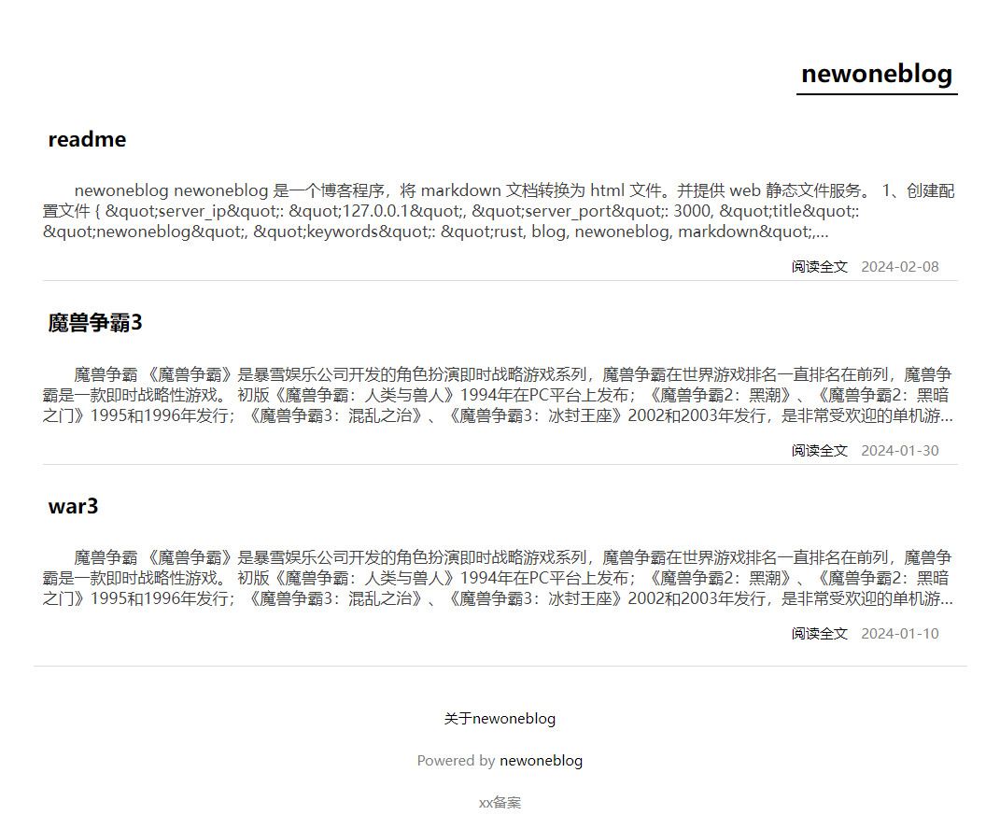

# newoneblog

newoneblog 是一个博客程序，将 markdown 文档转换为 html 文件。并提供 web 静态文件服务。

## 1、创建配置文件

```json
{
  "server_ip": "127.0.0.1",
  "server_port": 3000,
  "title": "newoneblog",
  "keywords": "rust, blog, newoneblog, markdown",
  "description": "一个通过markdown生成博客的程序",
  "markdown_path": "./markdown",
  "template_path": "./templates/newoneblog",
  "public_path": "./public",
  "ignore_markdown_path": [],
  "footer_html": "<div>xx备案</div>"
}
```

| 配置字段             | 描述                         |
| -------------------- | ---------------------------- |
| server_ip            | web 服务 ip 地址             |
| server_port          | web 服务端口                 |
| title                | 网站标题                     |
| keyword              | 网站关键字                   |
| markdown_dir         | markdown 目录                |
| template_path        | 网站模板目录                 |
| public_path          | 生成的 html 存放目录         |
| ignore_markdown_path | 忽略的 markdown 文件或者路径 |
| ignore_markdown_path | 底部html代码                 |

## 2、启动

```shell
cargo run
```

运行后会根据 markdown 和 template 目录，生成 html 文件到 public 目录下。

访问 `http://127.0.0.1:3000` 查看网站。


